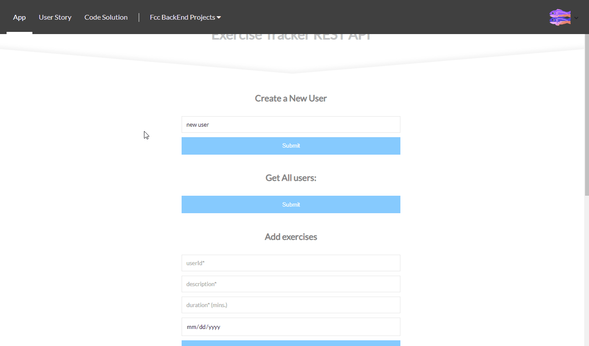

# API Project: Exercise Tracker REST API
### About the project

it's a freecodecamp project in the "Apis and Microservices Projects" module, you have to build an API that will receive a USER_ID and return a json response containing the exercises sent by that user.

bonus*: 
- Front-end using React

### Tools used

**Front-end:** React

**Back-end:** Express, mongodb, mongoose

### Screenshot

### Link

https://fcc-bt-exercise-tracker.glitch.me

### User stories

1. I can create a user by posting form data username to `/api/exercise/new-user` and returned will be an object with `username` and `_id`.
2. I can get an array of all users by getting `api/exercise/users with` the same info as when creating a user.
3. I can add an exercise to any user by posting form data `userId`(_id), `description`, `duration`, and optionally `date` to `/api/exercise/add`. If no date supplied it will use current date. Returned will the the user object with also with the exercise fields added.
4. I can retrieve a full exercise log of any user by getting `/api/exercise/log` with a parameter of `userId(_id)`. Return will be the user object with added array log and count (total exercise count).
5. I can retrieve part of the log of any user by also passing along optional parameters of from & to or limit. (Date format yyyy-mm-dd, limit = int)
